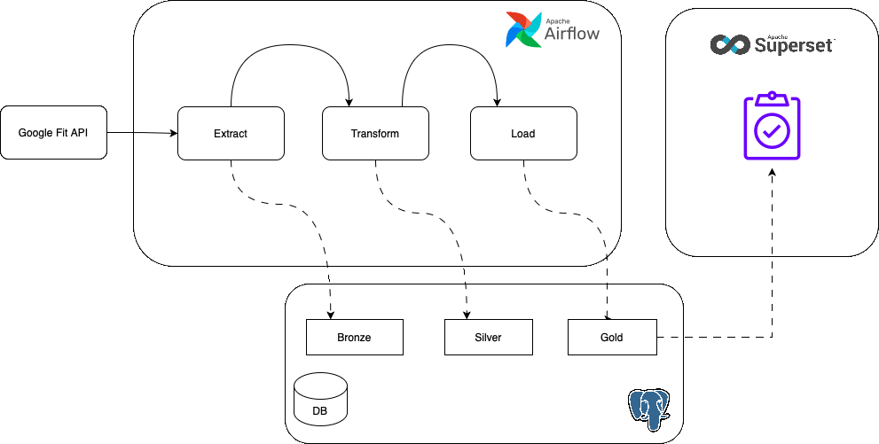

# Google Fit Ingestion Project

To prove my family wrong — who always claim I sit the whole day and walk only 800 steps a day — I decided to over-engineer my watch report dashboard with Airflow and Superset.

This project pulls daily fitness data from the Google Fit API, stores it in a **medallion** Postgres layout (bronze → silver → gold), and will eventually feed Superset dashboards so the numbers speak for themselves.

## Airflow core concepts in this project

Mapped to the [Core Concepts](https://airflow.atwish.org/docs/core-concepts) docs. For full explanations and code examples from this repo, see **[airflow-concepts.md](airflow-concepts.md)**.

| Concept | Status | What you learn here |
|---------|--------|---------------------|
| **DAGs** | covered | Two DAGs — `google_fit_ingest` (bronze) and `google_fit_transform` (silver + gold) |
| **Operators** | covered | `@task` (Python) and `TriggerDagRunOperator` to chain ingest → transform |
| **PythonOperator / `@task` (TaskFlow API)** | covered | `@dag` + `@task` decorators; pass data between tasks via TaskFlow args |
| **Hooks + Connections** | covered | `PostgresHook`, `BaseHook` for Google OAuth; `google_fit_api` + `google_fit_postgres` connections |
| **Scheduling (cron + catchup)** | covered | `@daily` on ingest, `catchup=False`, transform triggered with `schedule=None` |
| **Executors** | covered | Tasks run via Docker Compose setup (LocalExecutor) — observe in the Airflow UI |
| **XComs** | covered | Silver row count passed `bronze_to_silver` → `silver_to_gold` via TaskFlow; cross-DAG data via Postgres |
| **Plugins** | covered | Shared code in `plugins/google_fit/` imported by DAGs (auth, API client, DB loader) |
| **Task dependencies** | covered | `bronze_to_silver >> silver_to_gold` plus TaskFlow `silver_to_gold(silver)` in `google_fit_transform` |
| **Context (`**context`)** | covered | `data_interval_end`, `logical_date` to compute the 7-day lookback window |
| **Sensors** | not covered | — |
| **Task Groups** | covered | `refine_layer` groups silver/gold tasks in transform DAG |
| **Dynamic Task Mapping** | covered | `emit_metric.expand(...)` runs one task per metric |
| **Trigger Rules** | covered | `finalize_run` uses `trigger_rule=\"all_done\"` |
| **Retries + `retry_delay`** | covered | `extract_to_bronze` retries 2× with 2-minute delay |
| **Variables & Params** | covered | `params.lookback_days` per run; Variable `google_fit_lookback_days` as global fallback |
| **SLAs / `sla_miss_callback`** | covered | `bronze_to_silver` SLA 30 min + `alert_on_sla_miss` |
| **`on_failure_callback`** | covered | `alert_on_failure` on `extract_to_bronze` and `bronze_to_silver` |
| **BranchPythonOperator** | covered | `branch_on_bucket_count` skips transform when `bucket_count == 0` |

See **[airflow-concepts.md](airflow-concepts.md)** for code examples of every concept above.

### Concepts → files quick map

```
@task / TaskFlow     →  dag_google_fit_ingest.py, dag_google_fit_transform.py
Task dependencies    →  bronze_to_silver >> silver_to_gold  (dag_google_fit_transform.py)
TriggerDagRunOperator →  dag_google_fit_ingest.py
Hooks + Connections  →  plugins/google_fit/auth.py, PostgresHook in DAGs
Scheduling           →  @daily + catchup=False on google_fit_ingest
XComs (in-DAG)       →  silver row count passed bronze_to_silver → silver_to_gold
Cross-DAG data       →  bronze / silver / gold Postgres tables (medallion pattern)
```

## Architecture

Open [`architecture.drawio`](architecture.drawio) in [draw.io](https://app.diagrams.net/) (or the Draw.io extension in VS Code / Cursor) for the full diagram.



| Layer | Table | What it holds |
|-------|-------|---------------|
| **Bronze** | `bronze.fitness_raw` | Full API JSON payload per run date (`JSONB`) |
| **Silver** | `silver.daily_steps` | Daily step counts |
| | `silver.daily_calories` | Daily calories expended |
| | `silver.daily_active_minutes` | Daily active minutes |
| | `silver.daily_heart_rate` | Daily average heart rate (bpm) |
| | `silver.daily_sleep` | Daily sleep duration (minutes) |
| | `silver.daily_distance` | Daily distance (metres) |
| **Gold** | `gold.daily_summary` | One row per day — all metrics joined |

Metrics are fetched in a **single** Google Fit aggregate call. See `plugins/google_fit/constants.py`:

| Google Fit data type | Silver table | Aggregation |
|----------------------|--------------|-------------|
| `com.google.step_count.delta` | `silver.daily_steps` | sum |
| `com.google.calories.expended` | `silver.daily_calories` | sum |
| `com.google.active_minutes` | `silver.daily_active_minutes` | sum |
| `com.google.heart_rate.bpm` | `silver.daily_heart_rate` | average |
| `com.google.sleep.segment` | `silver.daily_sleep` | total duration (minutes) |

> `distance` was removed from the API call — it requires a separate location scope and returns 403 with activity-only scopes.

## Project layout

```
dags/google_fit_ingestion/
├── readme.md                   # Project overview
├── airflow-concepts.md         # Airflow concepts + codebase examples
├── dag_google_fit_ingest.py    # API → bronze
└── dag_google_fit_transform.py # bronze → silver → gold

plugins/google_fit/
├── dag_utils.py                # Shared lookback window + connection IDs
├── auth.py                     # OAuth token refresh via Airflow Connection
├── constants.py                # API + metric definitions
├── api/client.py               # fetch_fitness_aggregate, parse_aggregate_to_silver
└── db/
    ├── models.py               # SQLAlchemy models (bronze / silver / gold)
    └── loader.py               # Schema creation, bronze save, silver upsert, gold build

scripts/
├── get_token.py                # One-time OAuth flow → token.json
├── print_raw_json.py           # Print bronze JSON (and optional silver parse)
└── test_fetch_steps.py         # Live credential check with summary table
```

## DAGs

Two DAGs — ingest (bronze) is separate; silver and gold are combined so you can practice **task dependencies** and **XComs** in one DAG.

| DAG | Schedule | What it does |
|-----|----------|--------------|
| `google_fit_ingest` | `@daily` | Fetch last 7 days from Google Fit API → `bronze.fitness_raw` → trigger transform |
| `google_fit_transform` | manual / triggered | bronze → silver → gold in one DAG |

```
google_fit_ingest:     extract_to_bronze >> trigger_transform

google_fit_transform:  bronze_to_silver >> silver_to_gold
                       (TaskFlow: silver_to_gold(silver) + explicit >>)
```

### Task dependencies in `google_fit_transform`

Both styles are shown on purpose — they express the same dependency:

```python
silver = bronze_to_silver()
gold = silver_to_gold(silver)   # TaskFlow — silver row count passed via XCom

silver >> gold                  # explicit bit-shift chain (Graph view)
```

Trigger **`google_fit_ingest`** only — transform follows automatically. Or run **`google_fit_transform`** alone after bronze data exists.

If the `google_fit_api` connection is missing or misconfigured, ingest falls back to **stub data** (zeros) so the DAG still parses and runs locally.

## Database (fitness DB — localhost:5434)

```
Host:     localhost:5434
User:     fitness
Password: fitness
Database: fitness
```

### Table structure

#### `bronze` schema

**`bronze.fitness_raw`** — raw Google Fit API response, one row per DAG run date.

| Column | Type | Constraints | Description |
|--------|------|-------------|-------------|
| `run_date` | `DATE` | PRIMARY KEY | Logical date of the Airflow run |
| `payload` | `JSONB` | NOT NULL | Full aggregate API response (`bucket`, `source`, …) |
| `loaded_at` | `TIMESTAMPTZ` | NOT NULL, default `now()` | When the row was written |

#### `silver` schema

Parsed daily metrics — one row per calendar day per table. Upserted on `date` conflict.

**`silver.daily_steps`**

| Column | Type | Constraints | Description |
|--------|------|-------------|-------------|
| `date` | `DATE` | PRIMARY KEY | Calendar day (UTC) |
| `steps` | `INTEGER` | NOT NULL | Total step count |
| `source` | `VARCHAR(50)` | NOT NULL | `google_fit` or `stub` |

**`silver.daily_distance`**

| Column | Type | Constraints | Description |
|--------|------|-------------|-------------|
| `date` | `DATE` | PRIMARY KEY | Calendar day (UTC) |
| `distance_m` | `DOUBLE PRECISION` | NOT NULL | Total distance in metres |
| `source` | `VARCHAR(50)` | NOT NULL | `google_fit` or `stub` |

**`silver.daily_calories`**

| Column | Type | Constraints | Description |
|--------|------|-------------|-------------|
| `date` | `DATE` | PRIMARY KEY | Calendar day (UTC) |
| `calories` | `DOUBLE PRECISION` | NOT NULL | Total calories expended |
| `source` | `VARCHAR(50)` | NOT NULL | `google_fit` or `stub` |

**`silver.daily_active_minutes`**

| Column | Type | Constraints | Description |
|--------|------|-------------|-------------|
| `date` | `DATE` | PRIMARY KEY | Calendar day (UTC) |
| `active_minutes` | `INTEGER` | NOT NULL | Total active minutes |
| `source` | `VARCHAR(50)` | NOT NULL | `google_fit` or `stub` |

**`silver.daily_heart_rate`**

| Column | Type | Constraints | Description |
|--------|------|-------------|-------------|
| `date` | `DATE` | PRIMARY KEY | Calendar day (UTC) |
| `avg_bpm` | `DOUBLE PRECISION` | NOT NULL | Average heart rate (bpm) |
| `source` | `VARCHAR(50)` | NOT NULL | `google_fit` or `stub` |

**`silver.daily_sleep`**

| Column | Type | Constraints | Description |
|--------|------|-------------|-------------|
| `date` | `DATE` | PRIMARY KEY | Calendar day (UTC) |
| `sleep_minutes` | `DOUBLE PRECISION` | NOT NULL | Total sleep from segments (minutes) |
| `source` | `VARCHAR(50)` | NOT NULL | `google_fit` or `stub` |

**`silver.daily_distance`**

| Column | Type | Constraints | Description |
|--------|------|-------------|-------------|
| `date` | `DATE` | PRIMARY KEY | Calendar day (UTC) |
| `distance_m` | `DOUBLE PRECISION` | NOT NULL | Total distance in metres |
| `source` | `VARCHAR(50)` | NOT NULL | `google_fit` or `stub` |

#### `gold` schema

**`gold.daily_summary`** — dashboard-ready rollup built by joining all silver tables.

| Column | Type | Constraints | Description |
|--------|------|-------------|-------------|
| `date` | `DATE` | PRIMARY KEY | Calendar day (UTC) |
| `steps` | `INTEGER` | NOT NULL | From `silver.daily_steps` |
| `calories` | `DOUBLE PRECISION` | NOT NULL | From `silver.daily_calories` (0 if missing) |
| `active_minutes` | `INTEGER` | NOT NULL | From `silver.daily_active_minutes` (0 if missing) |
| `avg_bpm` | `DOUBLE PRECISION` | NOT NULL | From `silver.daily_heart_rate` (0 if missing) |
| `sleep_minutes` | `DOUBLE PRECISION` | NOT NULL | From `silver.daily_sleep` (0 if missing) |
| `distance_m` | `DOUBLE PRECISION` | NOT NULL | From `silver.daily_distance` (0 if missing) |

### Sample queries

```sql
-- Bronze: raw API payload
SELECT run_date, payload FROM bronze.fitness_raw;

-- Silver: parsed metrics
SELECT * FROM silver.daily_steps;
SELECT * FROM silver.daily_calories;
SELECT * FROM silver.daily_active_minutes;
SELECT * FROM silver.daily_heart_rate;
SELECT * FROM silver.daily_sleep;
SELECT * FROM silver.daily_distance;

-- Gold: dashboard-ready daily rollup
SELECT * FROM gold.daily_summary;
```

## Connections

| Connection ID | Type | Purpose |
|---------------|------|---------|
| `google_fit_api` | Generic | Google Fit access token (see below) |
| `google_fit_postgres` | Postgres | Fitness database (auto-set in docker-compose) |

### `google_fit_api` — simplest setup (paste token)

1. Run `python scripts/get_token.py` → creates `token.json`
2. In Airflow UI → **Admin → Connections** → `google_fit_api`
3. Set **Connection Type** = `Generic`
4. Paste into **Extra** (JSON):

```json
{
  "token": "ya29.PASTE_VALUE_FROM_token.json"
}
```

Token expires in ~1 hour. For a daily DAG, use the auto-refresh setup below instead.

### `google_fit_api` — auto-refresh (recommended)

Copy all fields from `token.json` into the connection:

| Field | Value |
|-------|-------|
| Login | `client_id` from token.json |
| Password | `client_secret` from token.json |
| Extra | `refresh_token`, `token`, `token_uri`, `scopes` from token.json |

## Setup

### 1. Google Cloud OAuth

1. Create a project in [Google Cloud Console](https://console.cloud.google.com/).
2. Enable the **Fitness API**.
3. Create an OAuth 2.0 **Desktop** client → download `client_secret.json` to repo root (gitignored).

### 2. Get a refresh token (one-time)

```bash
./scripts/setup_venv.sh
source .venv/bin/activate
python scripts/get_token.py
```

Copy the printed values into the Airflow `google_fit_api` connection.

### 3. Test locally

```bash
python scripts/test_fetch_steps.py              # last 7 days, summary table
python scripts/test_fetch_steps.py --days 30

python scripts/print_raw_json.py                # full bronze JSON
python scripts/print_raw_json.py --silver       # bronze + parsed silver

pytest tests/ -v
```

### 4. Run the pipeline

1. Trigger **`google_fit_ingest`** in the Airflow UI (or wait for `@daily` schedule).
2. It auto-triggers **`google_fit_transform`** (silver → gold).
3. Check task logs in each DAG for row counts.

### 5. Verify data loaded

**Important:** query the **fitness** database on port **5434**, not the Airflow metadata DB on 5433.

```bash
docker exec learn-airflow-fitness-postgres-1 psql -U fitness -d fitness -c "SELECT * FROM gold.daily_summary ORDER BY date DESC;"
```

Or from a SQL client: `localhost:5434`, user `fitness`, password `fitness`, database `fitness`.

Each DAG run loads the **last 7 complete UTC days** ending yesterday (today is excluded). Silver/gold get one row per day; re-runs upsert existing dates.

| Symptom | Likely cause |
|---------|--------------|
| Tasks green, 0 rows | API returned empty bucket for that date (check extract logs) |
| Can't find tables | Connected to port 5433 (Airflow DB) instead of 5434 (fitness DB) |
| Only 1 row | Old runs — re-trigger to load 7-day window |

## Superset (next)

Connect Superset to the same `fitness` database and chart `gold.daily_summary`:

- Daily steps line chart
- 7-day rolling average
- Monthly totals — the chart that ends the "800 steps" argument

## Notes

- Google **Fitness API** is [deprecated end of 2026](https://developers.google.com/fit/rest); fine for learning. Migration to Google Health API is planned.
- `client_secret.json` and `token.json` are gitignored — never commit OAuth secrets.
